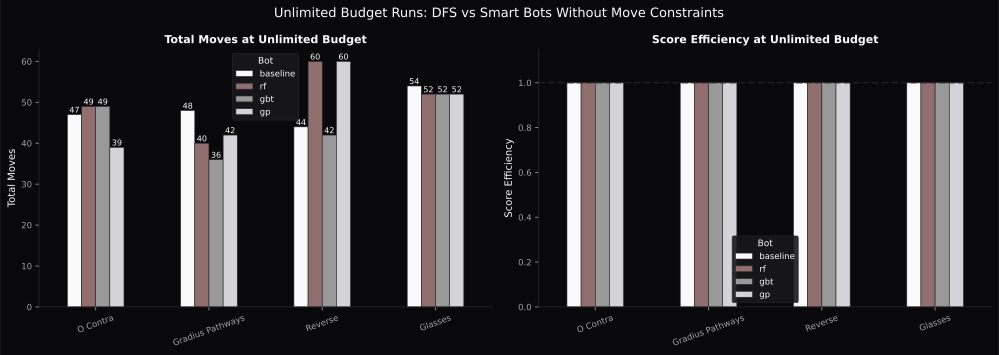
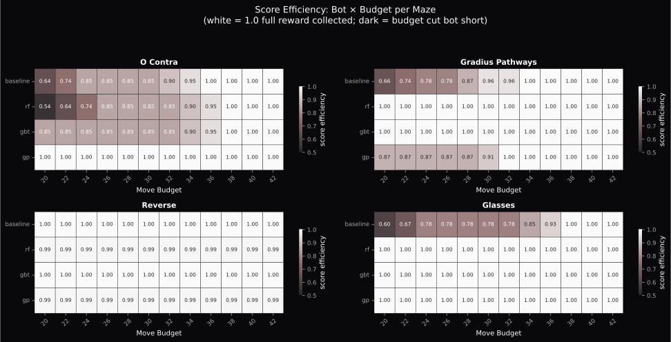
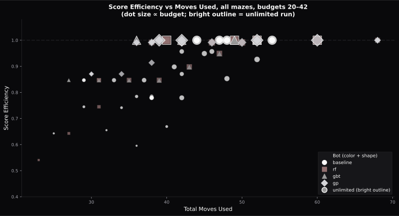
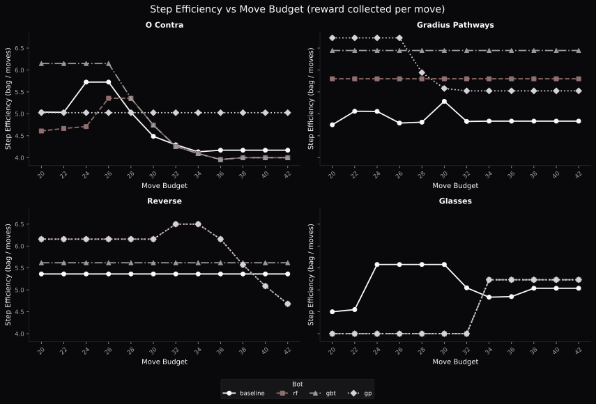
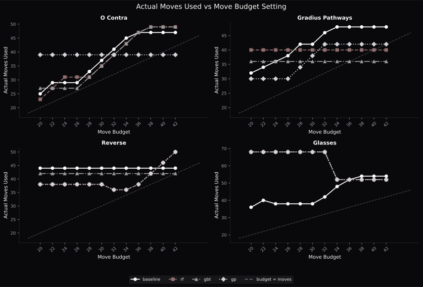
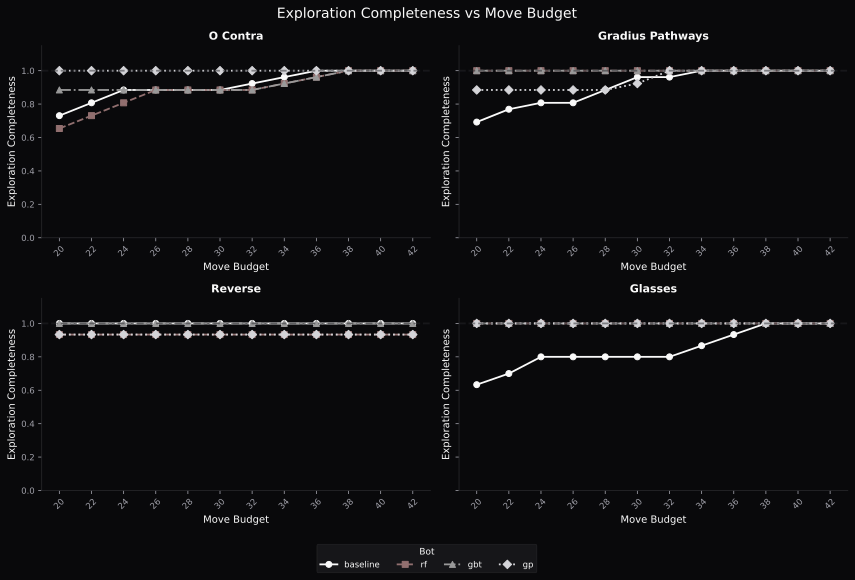
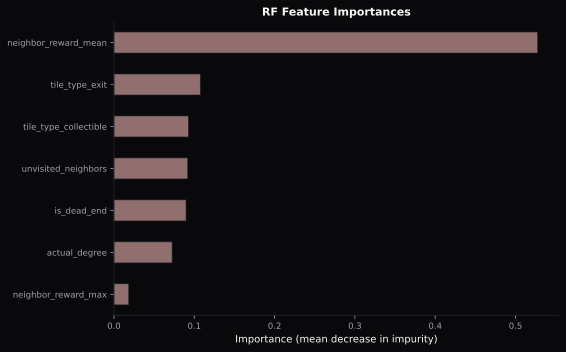

Evaluation
==========

We compared the baseline bot (DFS) against the three smart bots on four held-out
evaluation mazes: Gradius Pathways, O Contra, Glasses, and Reverse. None of these
appeared in training.

Metrics
-------

.. list-table::
   :header-rows: 1
   :widths: 30 30 40

   * - Metric
     - Formula
     - What it shows
   * - Score efficiency
     - score collected / potential reward
     - How much of the available reward was captured
   * - Step efficiency
     - score collected / total moves
     - Reward earned per API call
   * - Collection rate
     - score in bag / (score in bag + score lost on exit)
     - How consistently the bot bags score before exiting
   * - Exploration completeness
     - tiles visited / total tiles
     - Whether the bot fully explored the maze

Baseline vs smart bots
-----------------------

The baseline explores every tile before exiting, so its score efficiency is near
100%. The smart bots prioritize high-value tiles first, so they reach the same
reward in fewer moves. That difference is visible in step efficiency.

The real advantage becomes clear when a move budget is imposed. With a limited
number of moves, the smart bot has already visited the most valuable tiles, so it
exits with more score. The baseline, which visits tiles in graph order, may not
have reached the high-reward areas yet.

Feature importances
-------------------

The RF model confirms that ``neighbor_reward_mean`` is by far the most informative
feature (importance ~0.53), consistent with the Pearson correlation found during
exploration. The next most informative features are ``tile_type_exit`` (~0.11) and
``tile_type_collectible`` (~0.09). Notably, ``neighbor_reward_max`` is the least
informative feature (~0.02) despite being a neighbor-reward statistic.

