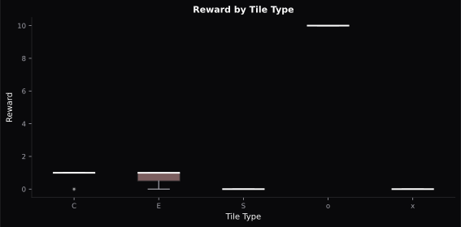
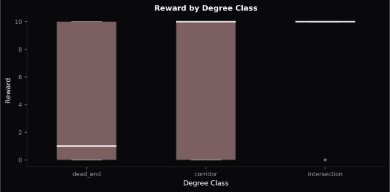
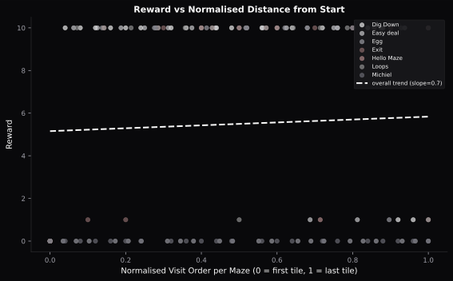
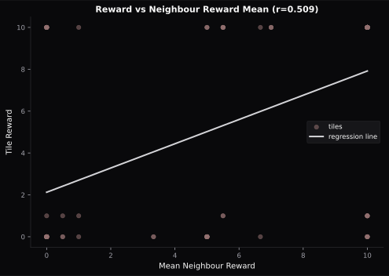
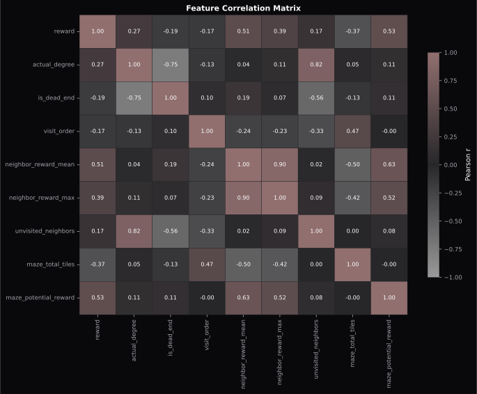

Data Exploration
================

We ran the baseline bot across seven training mazes and recorded a feature row
for each tile visited. The goal was to find which tile properties predict reward,
so we could pick sensible features for the ML models.

The training set covers roughly 150-200 tiles across mazes of varying size and
layout (Hello Maze, Exit, Loops, Easy deal, Michiel, Dig Down, Egg).

Finding 1: tile type and reward
---------------------------------

Reward tiles (``o``) carry the highest rewards in training data (median ~10).
Collection points (``C``) and exit tiles (``E``) have low rewards (median ~1),
while start (``S``) and empty (``x``) tiles have zero reward. Collection and exit
tile reward values are set by the maze designer independently. This held across
all seven training mazes.

.. note::
   This pattern may not hold in evaluation mazes. Collection and exit tile
   rewards are designer-controlled, so we avoided encoding tile type as a direct
   reward predictor.

Finding 2: degree class and reward
-------------------------------------

Tiles with more connections (intersections, corridors) tend to carry higher
rewards than dead ends. Dead ends had the lowest median reward in training data.

Finding 3: distance from start
---------------------------------

We tested whether tiles farther from the start tile tend to have higher rewards.
The Pearson correlation was close to zero, so distance from start is not a useful
feature.

Finding 4: neighborhood reward
---------------------------------

The average reward of a tile's immediate neighbors (``neighbor_reward_mean``) is
the strongest single predictor we found, with Pearson r = 0.509. Tiles in
high-reward clusters tend to be high-reward themselves.

.. _exploration-feature-selection:

Feature selection
-----------------

Based on these findings, the models train on these seven features:

.. list-table::
   :header-rows: 1
   :widths: 30 70

   * - Feature
     - Why it's included
   * - ``actual_degree``
     - Number of connections; correlates with reward (finding 2)
   * - ``is_dead_end``
     - Binary flag for degree == 1; adds a clear negative signal
   * - ``neighbor_reward_mean``
     - Strongest predictor found (finding 4)
   * - ``neighbor_reward_max``
     - Captures nearby high-value tiles
   * - ``unvisited_neighbors``
     - Proxy for how much unexplored space surrounds a tile
   * - ``tile_type_collectible``
     - Structural flag, included without reward assumption
   * - ``tile_type_exit``
     - Structural flag, included without reward assumption

``tile_type_reward`` and ``tile_type_empty`` are excluded because they encode
the reward sign by construction, including them would make the model circular.
