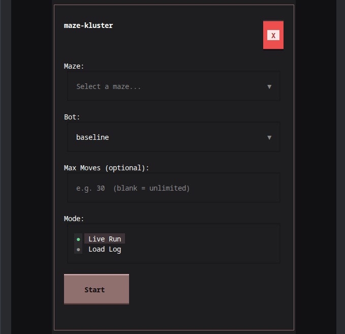
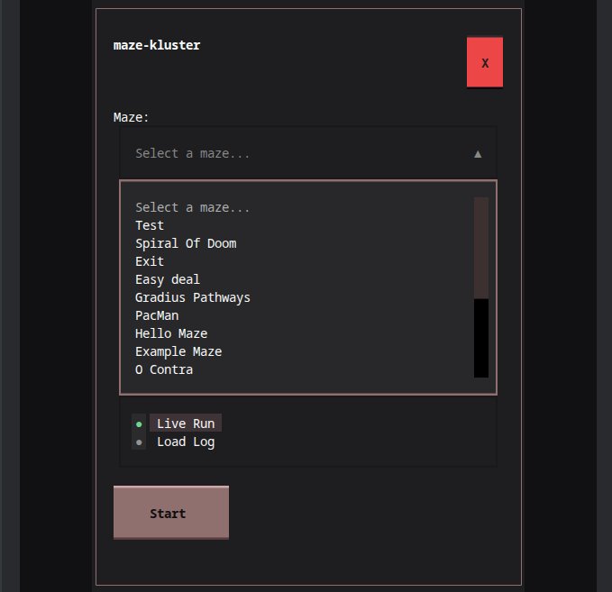
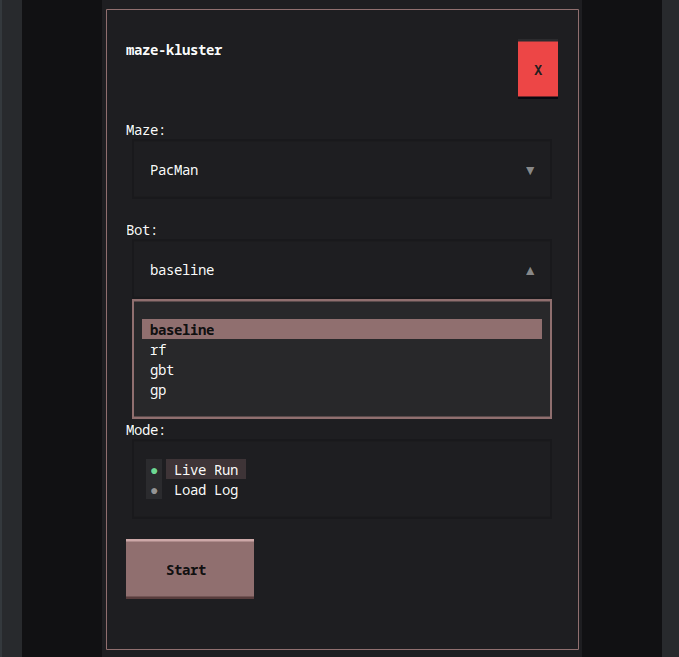
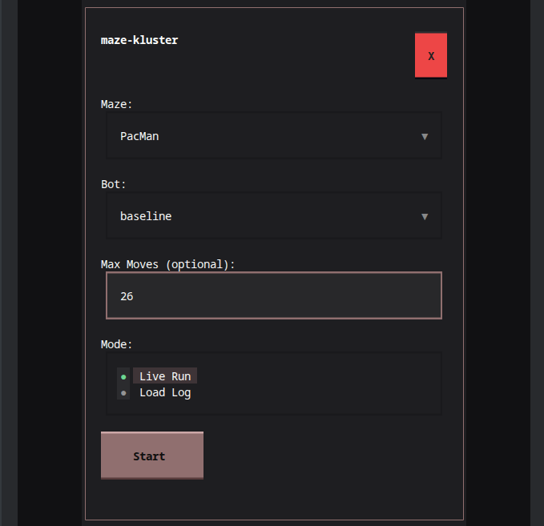
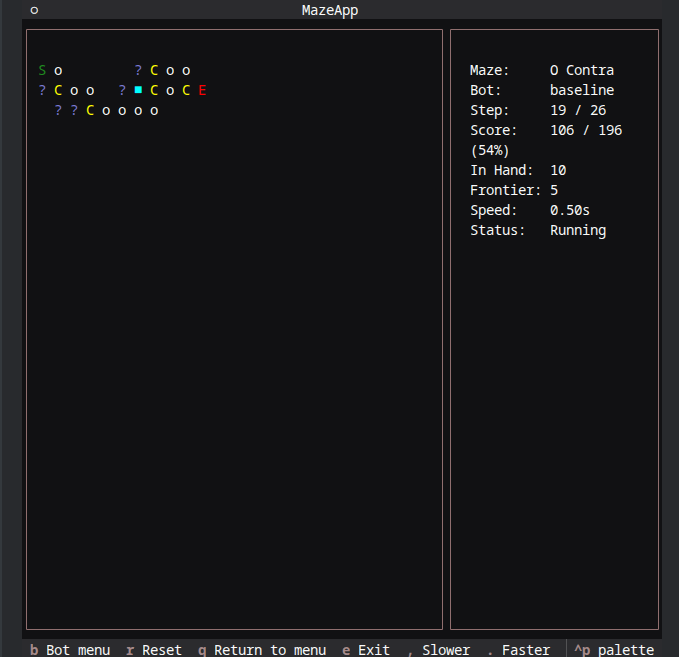
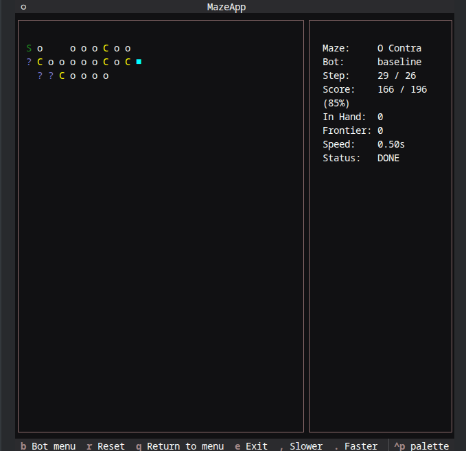
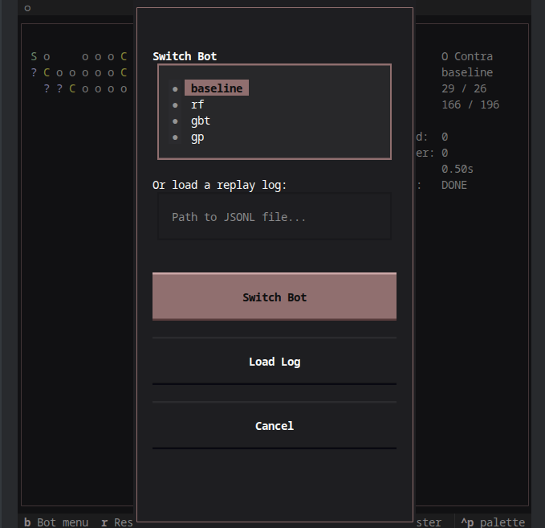
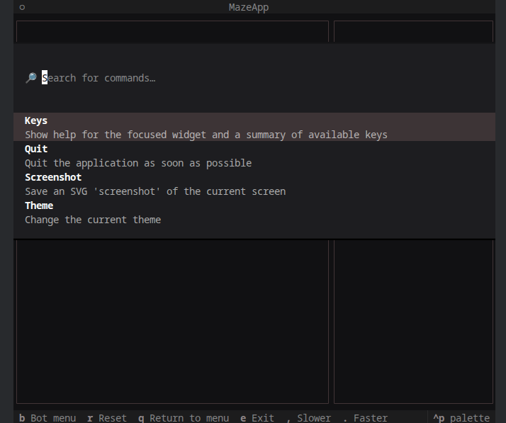

Walkthrough
===========

Main menu
---------

When you run ``maze-kluster tui`` without flags, the main menu opens.

Select a maze from the dropdown. The list shows all available mazes loaded from
``data/mazes.json``.

Then pick a bot. The baseline bot works without any setup. The smart bots (rf,
gbt, gp) require trained model files in ``models/``. See
:doc:`../getting-started/data-generation` for how to generate them.

Optionally set a **Max Moves** limit. When set, the bot stops exploring once
that step count is reached and instead navigates to the nearest collection
point to bank any score in hand, then heads for the exit. 
Leave the field blank for an unlimited run.

Choose Live Run to connect to the API, or Load Log to replay a recorded JSONL
file, then press Start.

Run view
--------

The run view shows the maze grid on the left and live stats on the right. The
stats panel shows the selected maze, bot, current score, steps taken, score in
hand, frontier size, and playback speed.

When the bot finishes exploring and exits, the status changes to DONE.

Tile legend
~~~~~~~~~~~

.. list-table::
   :header-rows: 1
   :widths: 15 20 65

   * - Symbol
     - Color
     - Meaning
   * - ``S``
     - green
     - Start tile
   * - ``o``
     - white
     - Reward tile (has reward > 0)
   * - ``x``
     - dim
     - Empty tile (no reward)
   * - ``C``
     - yellow
     - Collection point (bag score here)
   * - ``E``
     - red
     - Exit tile
   * - ``?``
     - blue dim
     - Frontier tile (seen but not yet visited)
   * - ``[bold]``
     - bold cyan
     - Current bot position
   * - (blank)
     - -
     - Unexplored (not yet visible)

Stats panel
~~~~~~~~~~~

The right panel shows:

- **Maze**: name of the current maze
- **Bot**: active bot name
- **Score**: score in bag / potential reward
- **Step**: moves made; shown as ``step / max`` when a max-moves limit is set
- **In Hand**: score collected but not yet bagged
- **Frontier**: number of tiles seen but not yet visited
- **Speed**: step delay in seconds
- **Status**: Running or DONE

Keyboard shortcuts
~~~~~~~~~~~~~~~~~~

.. list-table::
   :header-rows: 1
   :widths: 20 80

   * - Key
     - Action
   * - ``B``
     - Open the bot menu to switch bots or load a different log
   * - ``R``
     - Reset the current run
   * - ``Q``
     - Return to main menu
   * - ``E``
     - Exit the application
   * - ``,`` / ``.``
     - Decrease / increase replay speed

Bot menu
--------

Press ``B`` during a run to open the bot menu. Pick a different registered bot
to restart the run with that bot, or enter a JSONL path to switch to replay mode.

Command menu
------------

